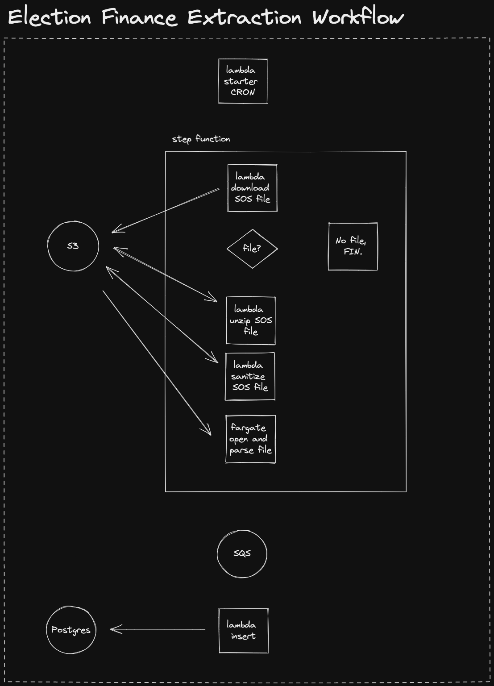

# Colorado Campaign Finance

## Workflow

This repository contains code to deploy a small "pipeline" that will retrieve a file published by the Colorado Secretary of State containing state campaign finance data.

## Technology Stack

### Deployment

- Github Actions
- AWS Cloud Development Kit, leveraging TypeScript.

### Execution

- AWS Lambda
  - Node.js
  - Python 3
- AWS Fargate
  - Docker

### Data Storage

- AWS SQS
- PostgreSQL